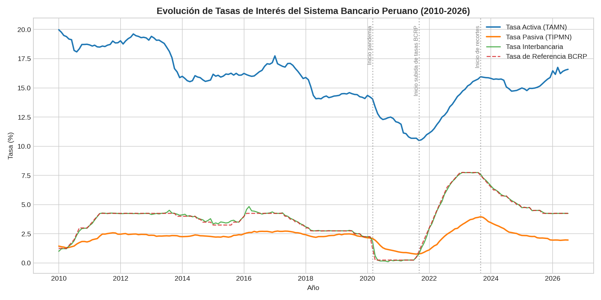
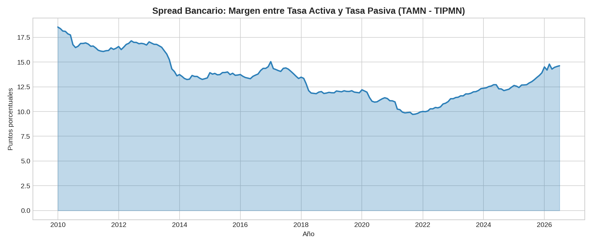

# Tasas de Interés del Sistema Bancario Peruano (2010-2026)

> **Resumen:** Analicé 15 años de tasas de interés del sistema bancario peruano (fuente: BCRP) para entender cómo se transmite la política monetaria del Banco Central hacia los bancos comerciales, y cómo ha evolucionado el margen de ganancia bancario (spread) a lo largo del tiempo.

**Stack técnico:** Python · Pandas · Matplotlib



## Descripción

Este proyecto usa la [API pública de series estadísticas del BCRP](https://estadisticas.bcrp.gob.pe/estadisticas/series/) para descargar y analizar 4 series mensuales de tasas de interés en soles, desde enero 2010 hasta julio 2026:

- **TAMN** — Tasa Activa promedio (lo que cobran los bancos por préstamos)
- **TIPMN** — Tasa Pasiva promedio (lo que pagan los bancos por depósitos)
- **Tasa Interbancaria** — tasa a la que los bancos se prestan entre sí
- **Tasa de Referencia BCRP** — la tasa de política monetaria del Banco Central

## Pipeline del Proyecto

- **Extracción:** Descarga automatizada desde la API REST del BCRP (sin autenticación).
- **Limpieza:** Parseo de fechas en español (ej. "Ene.2010"), unión de las 4 series por fecha, verificación de valores nulos (199 registros, 0 nulos).
- **Feature engineering:** Cálculo del *Spread Bancario* (Tasa Activa − Tasa Pasiva), el indicador clave de rentabilidad del sistema bancario.
- **Análisis exploratorio:** Evolución temporal, identificación de eventos macroeconómicos clave, correlación entre series.

## Interpretación de Resultados

- **La política monetaria se transmite casi de inmediato a la tasa interbancaria** (correlación de 1.00 con la tasa de referencia del BCRP), pero llega diluida y con rezago a la tasa activa que paga el cliente final (correlación de solo 0.27).
- **La pandemia marcó el mínimo histórico:** la tasa interbancaria llegó a 0.11% en septiembre 2020, siguiendo al BCRP en su esfuerzo por reactivar la economía con crédito barato.
- **El spread bancario se redujo 25% entre 2010 y 2025**, pasando de 17.4 a 13.0 puntos porcentuales en promedio.



## Conclusión del Proyecto

El spread bancario en Perú muestra una tendencia decreciente de largo plazo (más competencia o presión regulatoria en el sistema), pero es cíclico en el corto plazo: se amplía en momentos de incertidumbre económica (como el ciclo de subida de tasas 2022-2024) y se comprime en periodos de estabilidad. La velocidad de traspaso de la política monetaria también es asimétrica: la interbancaria reacciona al instante, mientras que las tasas al cliente final se ajustan con rezago.

## Aplicación Práctica

Este tipo de análisis de series temporales financieras tiene aplicaciones directas en:

- **Gestión de riesgo bancario:** monitorear el spread ayuda a anticipar presión sobre la rentabilidad del sector.
- **Análisis de política monetaria:** entender qué tan rápido y completo es el traspaso ("pass-through") de las decisiones del Banco Central hacia el crédito real.
- **Modelos predictivos:** esta serie limpia y estructurada es la base para modelos de forecasting de tasas (ARIMA, Prophet) o para features en modelos de scoring crediticio.

## Estructura del repositorio

```
├── data/
│   └── tasas_bancarias_peru_2010_2026.csv
├── images/
│   ├── grafico_1_evolucion_tasas.png
│   └── grafico_2_spread_bancario.png
├── analisis_tasas_bancarias.ipynb
└── README.md
```

## Fuente de datos

[BCRP - Estadísticas Económicas](https://estadisticas.bcrp.gob.pe/estadisticas/series/) — series `PN07807NM`, `PN07816NM`, `PN07819NM`, `PD04722MM`.
